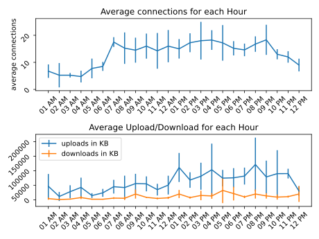
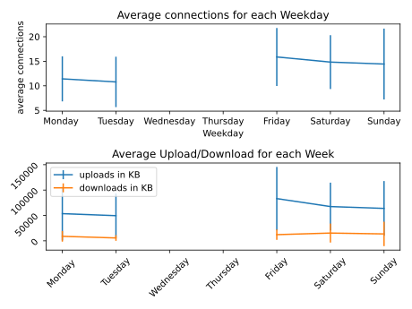
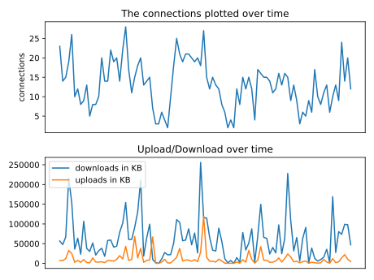

# Averages by Hour

 

 Hour | Connections | Uploads ↑ | Downloads ↓
---|---|---|---
01 AM | 6.75 | 46.52 MB | 3.96 MB
02 AM | 5.25 | 11.42 MB | 0.92 MB
03 AM | 5.25 | 27.94 MB | 2.36 MB
04 AM | 4.75 | 42.66 MB | 7.60 MB
05 AM | 7.75 | 14.60 MB | 2.00 MB
06 AM | 8.50 | 23.88 MB | 1.92 MB
07 AM | 17.50 | 45.12 MB | 5.76 MB
08 AM | 15.25 | 42.12 MB | 5.23 MB
09 AM | 14.50 | 55.83 MB | 19.87 MB
10 AM | 16.00 | 54.88 MB | 8.37 MB
11 AM | 14.25 | 34.88 MB | 4.61 MB
12 AM | 16.00 | 50.55 MB | 6.81 MB
01 PM | 15.00 | 111.25 MB | 19.85 MB
02 PM | 17.25 | 68.02 MB | 7.67 MB
03 PM | 18.00 | 81.14 MB | 14.94 MB
04 PM | 18.25 | 103.49 MB | 13.24 MB
05 PM | 17.20 | 74.57 MB | 32.20 MB
06 PM | 15.20 | 75.76 MB | 21.40 MB
07 PM | 14.60 | 81.67 MB | 9.93 MB
08 PM | 16.75 | 121.52 MB | 19.86 MB
09 PM | 18.33 | 78.63 MB | 13.44 MB
10 PM | 13.00 | 89.99 MB | 9.28 MB
11 PM | 12.00 | 90.21 MB | 10.86 MB
12 PM | 9.00 | 30.22 MB | 19.91 MB

# Averages by Week

 

  Weekday | Connections | Uploads ↑ | Downloads ↓
---|---|---|---
Monday  | 11.42 | 53.54 MB | 8.87 MB
Tuesday | 10.79 | 49.56 MB | 5.66 MB
Wednesday | nan | nan MB | nan MB
Thursday | nan | nan MB | nan MB
Friday | 15.88 | 83.14 MB | 12.16 MB
Saturday | 14.83 | 67.51 MB | 15.31 MB
Sunday | 14.43 | 63.86 MB | 13.61 MB

# Totals

  

 Connections | Uploads ↑ | Downloads ↓
---|---|---
1.29 thousand | 5.98 GB | 1.10 GB

# Global Averages

  Connections | Uploads ↑ | Downloads ↓
---|---|---
13.20 | 61.03 MB | 11.20 MB

